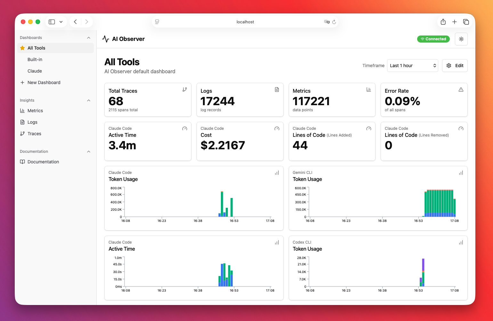
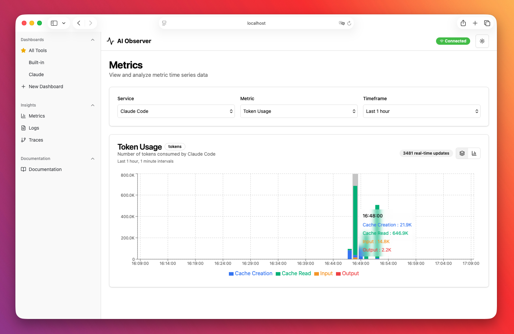
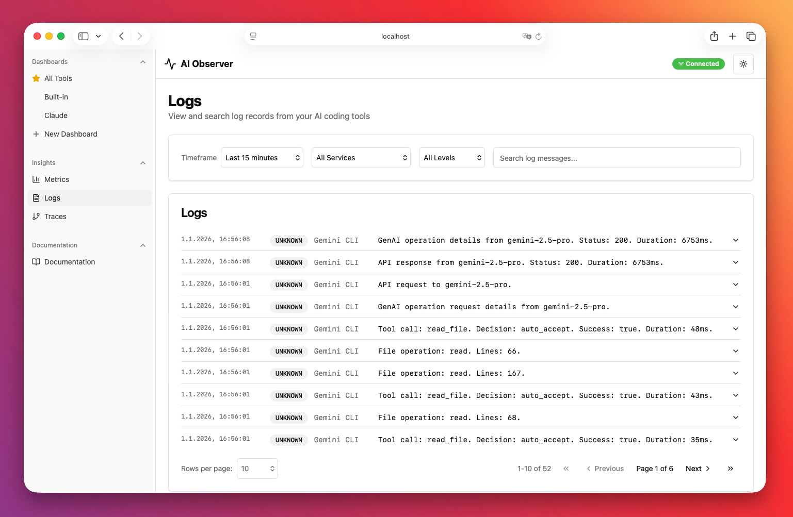
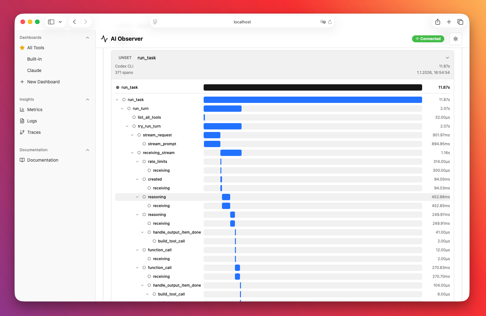

# AI Observer

> Unified local observability for AI coding assistants

**AI Observer** is a self-hosted, single-binary, OpenTelemetry-compatible observability backend designed specifically for monitoring local AI coding tools like Claude Code, Gemini CLI, and OpenAI Codex CLI.

Track token usage, costs, API latency, error rates, and session activity across all your AI coding assistants in one unified dashboard—with real-time updates and zero external dependencies.

## Why AI Observer?

AI coding assistants are becoming essential development tools, but understanding their behavior and costs remains a challenge:

- **Visibility**: See exactly how your AI tools are performing across sessions
- **Cost tracking**: Monitor token usage and API calls to understand spending
- **Debugging**: Trace errors and slow responses back to specific interactions
- **Privacy**: Keep your telemetry data local—no third-party services required

## Features

- **Multi-tool support** — Works with Claude Code, Gemini CLI, and OpenAI Codex CLI
- **Real-time dashboard** — Live updates via WebSocket as telemetry arrives
- **Customizable widgets** — Drag-and-drop dashboard builder with multiple widget types
- **Fast analytics** — DuckDB-powered storage for instant queries on large datasets
- **Single binary** — One ~54MB executable with embedded frontend—no external dependencies
- **Multi-arch Docker** — Ready-to-run ~97MB images for `linux/amd64` and `linux/arm64`
- **OTLP-native** — Standard OpenTelemetry Protocol ingestion (HTTP/JSON and HTTP/Protobuf)

## Screenshots

### Dashboard



### Metrics View



### Logs View



### Traces View



## Quick Start

### Using Docker (Recommended)

```bash
docker run -d \
  -p 8080:8080 \
  -p 4318:4318 \
  -v ai-observer-data:/app/data \
  --name ai-observer \
  tobilg/ai-observer:latest
```

Dashboard: http://localhost:8080

**Using a local directory for data persistence:**

```bash
# Create a local data directory
mkdir -p ./ai-observer-data

# Run with local volume mount
docker run -d \
  -p 8080:8080 \
  -p 4318:4318 \
  -v $(pwd)/ai-observer-data:/app/data \
  -e AI_OBSERVER_DATABASE_PATH=/app/data/ai-observer.duckdb \
  --name ai-observer \
  tobilg/ai-observer:latest
```

This stores the DuckDB database in your local `./ai-observer-data` directory, making it easy to backup or inspect.

### Using Homebrew (macOS Apple Silicon)

```bash
brew tap tobilg/ai-observer
brew install ai-observer
ai-observer
```

### Using Binary

Download the latest release for your platform from [Releases](https://github.com/tobilg/ai-observer/releases), then:

```bash
./ai-observer
```

### Building from Source

```bash
git clone https://github.com/tobilg/ai-observer.git
cd ai-observer
make setup   # Install dependencies
make all     # Build single binary with embedded frontend
./bin/ai-observer
```

## Configuration

### Environment Variables

| Variable | Default | Description |
|----------|---------|-------------|
| `AI_OBSERVER_API_PORT` | `8080` | HTTP server port (dashboard + API) |
| `AI_OBSERVER_OTLP_PORT` | `4318` | OTLP ingestion port |
| `AI_OBSERVER_DATABASE_PATH` | `./data/ai-observer.duckdb` (binary) or `/app/data/ai-observer.duckdb` (Docker) | DuckDB database file path |
| `AI_OBSERVER_FRONTEND_URL` | `http://localhost:5173` | Allowed CORS origin (dev mode) |

CORS and WebSocket origins allow `AI_OBSERVER_FRONTEND_URL` plus `http://localhost:5173` and `http://localhost:8080`; set `AI_OBSERVER_FRONTEND_URL` when serving a custom UI origin.

### CLI Options

```bash
ai-observer [options]
```

| Option | Description |
|--------|-------------|
| `-h`, `--help` | Show help message and exit |
| `-v`, `--version` | Show version information and exit |
| `-s`, `--setup TOOL` | Show setup instructions for TOOL (claude, gemini, codex) |

**Examples:**

```bash
# Show version
ai-observer --version

# Show setup instructions for Claude Code
ai-observer --setup claude
```

### AI Tool Setup

<details>
<summary><strong>Claude Code</strong></summary>

Configure the following environment variables:

```bash
# Enable telemetry (required)
export CLAUDE_CODE_ENABLE_TELEMETRY=1

# Configure exporters
export OTEL_METRICS_EXPORTER=otlp
export OTEL_LOGS_EXPORTER=otlp

# Set OTLP endpoint (HTTP)
export OTEL_EXPORTER_OTLP_PROTOCOL=http/protobuf
export OTEL_EXPORTER_OTLP_ENDPOINT=http://localhost:4318

# Set shorter intervals
export OTEL_METRIC_EXPORT_INTERVAL=10000  # 10 seconds (default: 60000ms)
export OTEL_LOGS_EXPORT_INTERVAL=5000     # 5 seconds (default: 5000ms)
```

Add these to your `~/.bashrc`, `~/.zshrc`, or shell profile to persist across sessions.

Claude Code will then automatically send metrics and events to AI Observer.

</details>

<details>
<summary><strong>Gemini CLI</strong></summary>

Add to `~/.gemini/settings.json`:

```json
{
  "telemetry": {
    "enabled": true,
    "target": "local",
    "useCollector": true,
    "otlpEndpoint": "http://localhost:4318",
    "otlpProtocol": "http",
    "logPrompts": true
  }
}
```

**Required environment variables** (workaround for Gemini CLI timing issues):

```bash
export OTEL_METRIC_EXPORT_TIMEOUT=10000
export OTEL_LOGS_EXPORT_TIMEOUT=5000
```

> **Note**: Gemini CLI sends OTLP data to `POST /` instead of standard paths. AI Observer auto-detects the signal type and routes accordingly.

</details>

<details>
<summary><strong>OpenAI Codex CLI</strong></summary>

Add to `~/.codex/config.toml`:

```toml
[otel]
log_user_prompt = true  # set to false to redact prompts
exporter = { otlp-http = { endpoint = "http://localhost:4318/v1/logs", protocol = "binary" } }
trace_exporter = { otlp-http = { endpoint = "http://localhost:4318/v1/traces", protocol = "binary" } }
```

> **Note**: Codex CLI exports logs and traces (no metrics). The `trace_exporter` option is undocumented but available—if omitted, traces are sent to the same endpoint as logs.

</details>

## Architecture

```
┌─────────────────┐     ┌─────────────────┐     ┌─────────────────┐
│   Claude Code   │     │   Gemini CLI    │     │   Codex CLI     │
└────────┬────────┘     └────────┬────────┘     └────────┬────────┘
         │                       │                       │
         │ OTLP/HTTP             │ OTLP/HTTP             │ OTLP/HTTP
         │ (traces, metrics,     │ (traces, metrics,     │ (logs)
         │  logs)                │  logs)                │
         └───────────────────────┼───────────────────────┘
                                 │
                                 ▼
                    ┌────────────────────────┐
                    │     AI Observer        │
                    │  ┌──────────────────┐  │
                    │  │   OTLP Ingestion │  │  ← Port 4318
                    │  │   (HTTP/Proto)   │  │
                    │  └────────┬─────────┘  │
                    │           │            │
                    │  ┌────────▼─────────┐  │
                    │  │     DuckDB       │  │
                    │  │   (Analytics)    │  │
                    │  └────────┬─────────┘  │
                    │           │            │
                    │  ┌────────▼─────────┐  │
                    │  │   REST API +     │  │  ← Port 8080
                    │  │   WebSocket Hub  │  │
                    │  └────────┬─────────┘  │
                    │           │            │
                    │  ┌────────▼─────────┐  │
                    │  │  React Dashboard │  │
                    │  │   (embedded)     │  │
                    │  └──────────────────┘  │
                    └────────────────────────┘
```

**Tech Stack**:
- **Backend**: Go 1.24+, chi router, DuckDB, gorilla/websocket
- **Frontend**: React 19, TypeScript, Vite, Tailwind CSS v4, Zustand, Recharts

## API Reference

AI Observer exposes two HTTP servers:

### OTLP Ingestion (Port 4318)

Standard OpenTelemetry Protocol endpoints for receiving telemetry data.
- Transport is HTTP/1.1 + h2c (no gRPC listener exposed); `Content-Encoding: gzip` is supported for compressed payloads.

| Method | Endpoint | Description |
|--------|----------|-------------|
| `POST` | `/v1/traces` | Ingest trace spans (protobuf or JSON) |
| `POST` | `/v1/metrics` | Ingest metrics (protobuf or JSON) |
| `POST` | `/v1/logs` | Ingest logs (protobuf or JSON) |
| `POST` | `/` | Auto-detect signal type (Gemini CLI compatibility) |
| `GET` | `/health` | Health check |

### Query API (Port 8080)

REST API for querying stored telemetry data. Unless otherwise specified, `from`/`to` default to the last 24 hours.

<details>
<summary><strong>Traces</strong></summary>

| Method | Endpoint | Description |
|--------|----------|-------------|
| `GET` | `/api/traces` | List traces with filtering and pagination |
| `GET` | `/api/traces/recent` | Get most recent traces |
| `GET` | `/api/traces/{traceId}` | Get a specific trace |
| `GET` | `/api/traces/{traceId}/spans` | Get all spans for a trace |

**Query parameters for `/api/traces`:**
- `service` — Filter by service name
- `search` — Full-text search
- `from`, `to` — Time range (ISO 8601)
- `limit`, `offset` — Pagination

</details>

<details>
<summary><strong>Metrics</strong></summary>

| Method | Endpoint | Description |
|--------|----------|-------------|
| `GET` | `/api/metrics` | List metrics with filtering |
| `GET` | `/api/metrics/names` | List all metric names |
| `GET` | `/api/metrics/series` | Get time series data for a metric |
| `POST` | `/api/metrics/batch-series` | Get multiple time series in one request |

**Query parameters for `/api/metrics/series`:**
- `name` — Metric name (required)
- `service` — Filter by service
- `from`, `to` — Time range (ISO 8601)
- `interval` — Aggregation interval (e.g., `1 minute`, `1 hour`)
- `aggregate` — Aggregate all series into one (default: `false`)

**Batch series (`POST /api/metrics/batch-series`) request body:**
- Each query requires `id` and `name`; optional `service`, `aggregate`, `interval`.
- Maximum 50 queries per request.
- `from`/`to` in the body also default to the last 24 hours if omitted.

</details>

<details>
<summary><strong>Logs</strong></summary>

| Method | Endpoint | Description |
|--------|----------|-------------|
| `GET` | `/api/logs` | List logs with filtering and pagination |
| `GET` | `/api/logs/levels` | Get log counts by severity level |

**Query parameters for `/api/logs`:**
- `service` — Filter by service name
- `severity` — Filter by severity (TRACE, DEBUG, INFO, WARN, ERROR, FATAL)
- `traceId` — Filter logs linked to a specific trace
- `search` — Full-text search
- `from`, `to` — Time range (ISO 8601)
- `limit`, `offset` — Pagination

</details>

<details>
<summary><strong>Dashboards</strong></summary>

| Method | Endpoint | Description |
|--------|----------|-------------|
| `GET` | `/api/dashboards` | List all dashboards |
| `POST` | `/api/dashboards` | Create a new dashboard |
| `GET` | `/api/dashboards/default` | Get the default dashboard with widgets |
| `GET` | `/api/dashboards/{id}` | Get a dashboard by ID |
| `PUT` | `/api/dashboards/{id}` | Update a dashboard |
| `DELETE` | `/api/dashboards/{id}` | Delete a dashboard |
| `PUT` | `/api/dashboards/{id}/default` | Set as default dashboard |
| `POST` | `/api/dashboards/{id}/widgets` | Add a widget |
| `PUT` | `/api/dashboards/{id}/widgets/positions` | Update widget positions |
| `PUT` | `/api/dashboards/{id}/widgets/{widgetId}` | Update a widget |
| `DELETE` | `/api/dashboards/{id}/widgets/{widgetId}` | Delete a widget |

</details>

<details>
<summary><strong>Other</strong></summary>

| Method | Endpoint | Description |
|--------|----------|-------------|
| `GET` | `/api/services` | List all services sending telemetry |
| `GET` | `/api/stats` | Get aggregate statistics |
| `GET` | `/ws` | WebSocket for real-time updates |
| `GET` | `/health` | Health check |

</details>

## Data Collected

AI Observer receives standard OpenTelemetry data:

| Signal | Description | Example Data |
|--------|-------------|--------------|
| **Traces** | Distributed tracing spans | API calls, tool executions, session timelines |
| **Metrics** | Numeric measurements | Token counts, latency histograms, request rates |
| **Logs** | Structured log records | Errors, prompts (if enabled), system events |

All data is stored locally in DuckDB. Nothing is sent to external services.

## Telemetry Reference

Each AI coding tool exports different telemetry signals. Here's what you can observe:

<details>
<summary><strong>Claude Code Metrics & Events</strong></summary>

### Metrics

| Metric | Display Name | Type | Description |
|--------|--------------|------|-------------|
| `claude_code.session.count` | Sessions | Counter | CLI sessions started |
| `claude_code.token.usage` | Token Usage | Counter | Tokens used (by type: input/output/cache) |
| `claude_code.cost.usage` | Cost | Counter | Session cost in USD |
| `claude_code.lines_of_code.count` | Lines of Code | Counter | Lines of code modified (added/removed) |
| `claude_code.pull_request.count` | Pull Requests | Counter | Pull requests created |
| `claude_code.commit.count` | Commits | Counter | Git commits created |
| `claude_code.code_edit_tool.decision` | Edit Decisions | Counter | Tool permission decisions (accept/reject) |
| `claude_code.active_time.total` | Active Time | Counter | Active time in seconds |

**Common attributes**: `session.id`, `organization.id`, `user.account_uuid`, `terminal.type`, `model`

### Events (Logs)

| Event | Display Name | Description | Key Attributes |
|-------|--------------|-------------|----------------|
| `claude_code.user_prompt` | User Prompt | User submits a prompt | `prompt_length`, `prompt` (if enabled) |
| `claude_code.api_request` | API Request | API request to Claude | `model`, `cost_usd`, `duration_ms`, `input_tokens`, `output_tokens` |
| `claude_code.api_error` | API Error | Failed API request | `error`, `status_code`, `attempt` |
| `claude_code.tool_result` | Tool Result | Tool execution completes | `tool_name`, `success`, `duration_ms`, `decision` |
| `claude_code.tool_decision` | Tool Decision | Permission decision made | `tool_name`, `decision`, `source` |

</details>

<details>
<summary><strong>Gemini CLI Metrics & Logs</strong></summary>

### Metrics

| Metric | Display Name | Type | Description |
|--------|--------------|------|-------------|
| `gemini_cli.session.count` | Sessions (Cumulative) | Counter | Sessions started (cumulative) |
| `gemini_cli.token.usage` | Token Usage (Cumulative) | Counter | Tokens by type (cumulative) |
| `gemini_cli.cost.usage` | Cost | Counter | Session cost in USD |
| `gemini_cli.api.request.count` | API Requests (Cumulative) | Counter | API requests by model and status (cumulative) |
| `gemini_cli.api.request.latency` | API Latency | Histogram | API request duration (ms) |
| `gemini_cli.api.request.breakdown` | API Request Breakdown | Histogram | Request phase analysis (ms) |
| `gemini_cli.tool.call.count` | Tool Calls | Counter | Tool invocations with success/decision |
| `gemini_cli.tool.call.latency` | Tool Latency | Histogram | Tool execution duration (ms) |
| `gemini_cli.tool.queue.depth` | Tool Queue Depth | Histogram | Number of pending tools in queue |
| `gemini_cli.tool.execution.breakdown` | Tool Execution Breakdown | Histogram | Phase-level tool execution durations (ms) |
| `gemini_cli.file.operation.count` | File Operations (Cumulative) | Counter | File operations by type and language (cumulative) |
| `gemini_cli.lines.changed` | Lines Changed | Counter | Lines added/removed |
| `gemini_cli.agent.run.count` | Agent Runs | Counter | Agent executions |
| `gemini_cli.agent.duration` | Agent Duration | Histogram | Agent run duration (ms) |
| `gemini_cli.agent.turns` | Agent Turns | Histogram | Interaction iterations per agent run |
| `gemini_cli.startup.duration` | Startup Duration | Histogram | Initialization time by phase (ms) |
| `gemini_cli.memory.usage` | Memory Usage | Histogram | Memory consumption (bytes) |
| `gemini_cli.cpu.usage` | CPU Usage | Histogram | Processor utilization (%) |
| `gemini_cli.chat_compression` | Chat Compression | Counter | Context compression events |
| `gemini_cli.chat.invalid_chunk.count` | Invalid Chunks | Counter | Malformed stream data count |
| `gemini_cli.chat.content_retry.count` | Content Retries | Counter | Recovery attempt count |
| `gemini_cli.chat.content_retry_failure.count` | Retry Failures | Counter | Exhausted retry attempts count |
| `gemini_cli.slash_command.model.call_count` | Model Commands | Counter | Model selections via slash commands |
| `gemini_cli.model_routing.latency` | Routing Latency | Histogram | Router decision timing (ms) |
| `gemini_cli.model_routing.failure.count` | Routing Failures | Counter | Model routing failure count |
| `gemini_cli.ui.flicker.count` | UI Flicker | Counter | Rendering instability events |
| `gemini_cli.token.efficiency` | Token Efficiency | Histogram | Output quality metrics ratio |
| `gemini_cli.performance.score` | Performance Score | Histogram | Composite performance benchmark |
| `gemini_cli.performance.regression` | Performance Regressions | Counter | Performance degradation count |
| `gemini_cli.performance.regression.percentage_change` | Regression Percentage | Histogram | Performance variance magnitude (%) |
| `gemini_cli.performance.baseline.comparison` | Baseline Comparison | Histogram | Performance baseline drift (%) |
| `gen_ai.client.token.usage` | GenAI Token Usage (Cumulative) | Histogram | Token consumption (OTel semantic convention) |
| `gen_ai.client.operation.duration` | GenAI Operation Duration | Histogram | Operation timing in seconds (OTel semantic convention) |

### Derived Metrics

AI Observer computes delta metrics from cumulative counters to show per-interval changes:

| Metric | Display Name | Description |
|--------|--------------|-------------|
| `gemini_cli.session.count.delta` | Sessions | Sessions per interval |
| `gemini_cli.token.usage.delta` | Token Usage | Tokens consumed per interval |
| `gemini_cli.api.request.count.delta` | API Requests | API requests per interval |
| `gemini_cli.file.operation.count.delta` | File Operations | File operations per interval |
| `gen_ai.client.token.usage.delta` | GenAI Token Usage | Token consumption per interval (OTel semantic convention) |

### Logs

| Log | Display Name | Description |
|-----|--------------|-------------|
| `gemini_cli.config` | Config | Startup configuration (model, sandbox, tools, extensions) |
| `gemini_cli.user_prompt` | User Prompt | User prompt with length and auth type |
| `gemini_cli.api_request` | API Request | API request details |
| `gemini_cli.api_response` | API Response | Response with token counts and finish reason |
| `gemini_cli.api_error` | API Error | Failed requests with error details |
| `gemini_cli.tool_call` | Tool Call | Tool execution with duration and arguments |
| `gemini_cli.file_operation` | File Operation | File create/read/update operations |
| `gemini_cli.agent.start` / `agent.finish` | Agent Start/Finish | Agent lifecycle events |
| `gemini_cli.model_routing` | Model Routing | Routing decisions with latency |
| `gemini_cli.chat_compression` | Chat Compression | Context compression events |
| `gemini_cli.conversation_finished` | Conversation Finished | Session completion with turn count |

</details>

<details>
<summary><strong>OpenAI Codex CLI Metrics & Events</strong></summary>

Codex CLI exports logs and traces directly. AI Observer derives metrics from these log events.

### Derived Metrics

AI Observer computes these metrics from Codex CLI log events:

| Metric | Display Name | Type | Description |
|--------|--------------|------|-------------|
| `codex_cli_rs.token.usage` | Token Usage | Counter | Tokens by type (input/output/cache/reasoning/tool) |
| `codex_cli_rs.cost.usage` | Cost | Counter | Session cost in USD |

### Events (Logs)

| Event | Display Name | Description | Key Attributes |
|-------|--------------|-------------|----------------|
| `codex.conversation_starts` | Sessions | Session initialization | Model, reasoning config, sandbox mode |
| `codex.api_request` | API Requests | API request to OpenAI | Duration, HTTP status, token counts |
| `codex.sse_event` | SSE Events | Streamed response chunk (filtered out / not stored) | Response metrics |
| `codex.user_prompt` | User Prompts | User prompt submitted | Character length (content redacted by default) |
| `codex.tool_decision` | Tool Decisions | Tool permission decision | Approval/denial status, decision source |
| `codex.tool_result` | Tool Results | Tool execution result | Duration, success status, output preview |

> **Note**: `codex.sse_event` events are filtered out by AI Observer to reduce noise—these are emitted for every SSE streaming chunk from the API.

### Traces

Codex CLI uses a **single trace per session**—all operations within a CLI session share the same trace ID with spans nested hierarchically:

```
TraceID (session-level)
└── run_task
    ├── run_turn (conversation turn 1)
    │   ├── try_run_turn
    │   ├── receiving_stream
    │   │   ├── reasoning / function_call
    │   │   └── receiving
    │   └── ...
    ├── run_turn (conversation turn 2)
    └── ...
```

This means long CLI sessions produce traces with thousands of spans spanning hours, rather than many short traces.

**AI Observer Trace Handling**: To improve usability, AI Observer treats each first-level child span (direct children of the session root) as a separate "virtual trace" in the dashboard. This splits long sessions into manageable units. However, since spans may arrive out of order, you may briefly see intermediate states where a span appears as its own trace before its parent arrives—once the parent span is received, the child automatically merges into the parent's trace on the next query refresh.

</details>

## Development

### Developer quickstart

```bash
make setup          # install Go + frontend deps
make backend-dev    # terminal 1: run API/OTLP server on 8080/4318
make frontend-dev   # terminal 2: Vite dev server on http://localhost:5173
# browse http://localhost:5173 (API + /ws proxied to :8080)
```

### Prerequisites

- Go 1.24+
- Node.js 20+
- pnpm
- Make

### Commands

```bash
make setup        # Install all dependencies
make dev          # Run backend + frontend in dev mode
make test         # Run all tests
make lint         # Run linters
make clean        # Clean build artifacts
```

### Project Structure

```
ai-observer/
├── backend/
│   ├── cmd/server/       # Main entry point
│   ├── internal/
│   │   ├── api/          # API types and helpers
│   │   ├── handlers/     # HTTP handlers
│   │   ├── otlp/         # OTLP decoders (proto/JSON)
│   │   ├── server/       # Server setup and routing
│   │   ├── storage/      # DuckDB storage layer
│   │   └── websocket/    # Real-time updates
│   └── pkg/compression/  # GZIP decompression
├── frontend/
│   ├── src/
│   │   ├── components/   # React components
│   │   ├── pages/        # Page components
│   │   ├── stores/       # Zustand stores
│   │   └── lib/          # Utilities
│   └── ...
└── Makefile
```

## CI/CD

GitHub Actions automatically:

| Trigger | Actions |
|---------|---------|
| Push/PR | Run tests (Go + frontend) |
| Push | Build binaries (linux/amd64, darwin/arm64, windows/amd64) |
| Tag `v*` | Create GitHub Release with archives |
| Tag `v*` | Push multi-arch Docker images |
| Release published | Update Homebrew formula in [ai-observer-homebrew](https://github.com/tobilg/ai-observer-homebrew) tap |

### Creating a Release

```bash
git tag v1.0.0
git push origin v1.0.0
```

## Troubleshooting

<details>
<summary><strong>Port already in use</strong></summary>

Change the ports using environment variables:

```bash
AI_OBSERVER_API_PORT=9090 AI_OBSERVER_OTLP_PORT=4319 ./ai-observer
```

</details>

<details>
<summary><strong>No data appearing in dashboard</strong></summary>

1. Verify your AI tool is configured correctly
2. Check that the OTLP endpoint is reachable: `curl http://localhost:4318/health`
3. Look for errors in the AI Observer logs

</details>

<details>
<summary><strong>CORS errors in browser console</strong></summary>

Set the `AI_OBSERVER_FRONTEND_URL` environment variable to match your frontend origin:

```bash
AI_OBSERVER_FRONTEND_URL=http://localhost:3000 ./ai-observer
```

</details>

## Contributing

Contributions are welcome! Please feel free to submit a Pull Request.

1. Fork the repository
2. Create your feature branch (`git checkout -b feature/amazing-feature`)
3. Commit your changes (`git commit -m 'Add some amazing feature'`)
4. Push to the branch (`git push origin feature/amazing-feature`)
5. Open a Pull Request

## License

This project is licensed under the MIT License - see the [LICENSE](LICENSE) file for details.

## Acknowledgments

- Built with [OpenTelemetry](https://opentelemetry.io/) standards
- Powered by [DuckDB](https://duckdb.org/) for fast analytics
- UI components from [shadcn/ui](https://ui.shadcn.com/)
